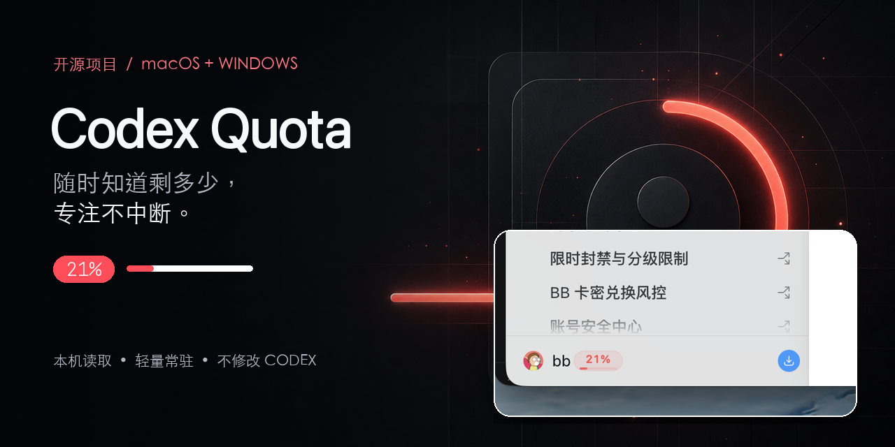
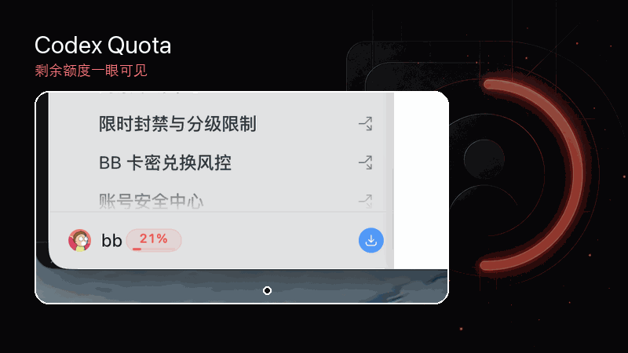
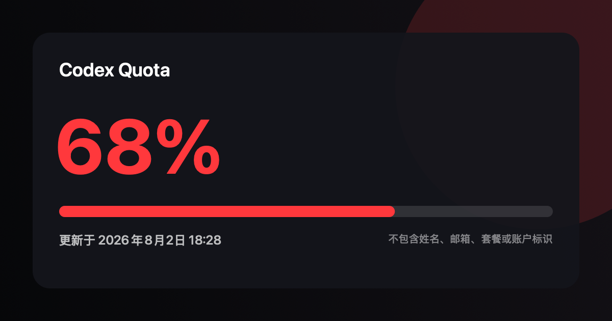

# Codex Quota

[简体中文](README.md)

<p align="center">
  
</p>

<p align="center">
  A lightweight macOS and Windows companion that shows your remaining Codex plan usage beside the account name in the Codex desktop app.
</p>

<p align="center">
  <a href="https://github.com/qxlfd666-wq/codex-quota/actions/workflows/ci.yml"></a>
  <a href="https://github.com/qxlfd666-wq/codex-quota/releases/latest"></a>
  <a href="LICENSE"></a>
  
  
  
</p>

> [!IMPORTANT]
> Codex Quota is an unofficial community project and is not affiliated with or endorsed by OpenAI. Codex, ChatGPT, OpenAI, and their respective marks belong to their owners.

## Download

| Platform | Direct download | Requirement |
| --- | --- | --- |
| macOS — Apple Silicon and Intel | [Codex-Quota-macOS.zip](https://github.com/qxlfd666-wq/codex-quota/releases/latest/download/Codex-Quota-macOS.zip) | macOS 14 or later |
| Windows x64 **Beta** | [Codex-Quota-Windows-x64.exe](https://github.com/qxlfd666-wq/codex-quota/releases/download/v1.2.0/Codex-Quota-Windows-x64.exe) | Windows 10/11 x64 |
| Windows ARM64 **Beta** | [Codex-Quota-Windows-arm64.exe](https://github.com/qxlfd666-wq/codex-quota/releases/download/v1.2.0/Codex-Quota-Windows-arm64.exe) | Windows 11 ARM64 |

The [v1.2.0 cross-platform release](https://github.com/qxlfd666-wq/codex-quota/releases/tag/v1.2.0) also contains Windows `.zip` packages and a `.sha256` file for every download.

> [!WARNING]
> Current community builds are not signed with an Apple Developer ID or a commercial Windows code-signing certificate. macOS Gatekeeper or Microsoft Defender SmartScreen may therefore show an unknown-publisher warning. Download only from this repository's Releases page and verify the matching SHA-256 file. The Windows build should be treated as Beta while signing and wider installer coverage are being prepared.

## See it in action

<p align="center">
  
</p>

## Features

- Places the remaining percentage and a slim progress bar beside Codex's existing avatar and account name.
- Uses red by default; click the badge to choose any color and keep that choice between launches.
- Tracks the Codex window as it moves, resizes, or changes display.
- On Windows, stays visible while the Codex window is available and fades smoothly when Codex is minimized or restored; on macOS, appears only while Codex is in the foreground. It hides when Codex is closed.
- Shows the remaining percentage in the macOS menu bar; the number inside the Windows tray icon is the remaining percentage.
- Copies a share-ready quota card that excludes names, email addresses, plan names, and other account identifiers.
- Refreshes every 60 seconds, with manual refresh from the macOS menu bar or Windows system tray.
- Supports launch at sign-in on Windows from the tray menu.
- Uses the local `codex app-server`; it does not inject code into or modify the official Codex app.
- Does not read or store your Codex login token.

## Screenshots

### Remaining usage beside the account name


### Share card without account information



### Click the badge to choose a color


## Requirements

- The current official Codex desktop app, open with its left sidebar expanded.
- A Codex session signed in with a ChatGPT account whose plan reports usage limits.
- API-key/pay-as-you-go sessions do not expose a plan percentage for this app to display.

Codex Quota has no separate main window. Only the badge receives pointer clicks; the rest of the overlay does not intercept Codex keyboard or pointer input.

## Install on macOS

1. Download and unzip `Codex-Quota-macOS.zip`.
2. Move `Codex Quota.app` to `/Applications` and open it.
3. Open Codex. The quota badge appears next to the account name in the lower-left sidebar.
4. Click the badge to change its color. The menu bar shows the remaining percentage directly; its menu can refresh, copy a share card, open Codex, or quit.

If Gatekeeper blocks the first launch, make sure the app came from this repository, try opening it once, then go to **System Settings → Privacy & Security** and choose **Open Anyway** for Codex Quota.

## Install on Windows — Beta

1. Download `Codex-Quota-Windows-x64.exe` (most PCs) or the ARM64 build.
2. Put the portable executable in a folder where you intend to keep it, then run it.
3. Open Codex. The quota badge appears next to the account name in the lower-left sidebar.
4. Click the badge to change its color. The tray icon shows the remaining percentage; right-click it to refresh, copy a share card, change color, enable launch at sign-in, copy diagnostics, or quit.

Because the executable is currently unsigned, SmartScreen may block it. If—and only if—you downloaded it from this repository and verified its checksum, use **More info → Run anyway**. Moving the executable after enabling launch at sign-in requires you to disable and re-enable that option so Windows stores the new path.

### Windows cannot read usage

Release v1.0.1 fixed helper detection for several Codex installations. If the tray still reports that usage cannot be read:

1. Upgrade to v1.0.1 or later.
2. Open the current official Codex app and confirm that it is signed in with a ChatGPT account. API-key/pay-as-you-go mode does not return a plan percentage.
3. Right-click the `%` tray icon, select **复制诊断信息** (Copy diagnostics), and include the result in a [bug report](https://github.com/qxlfd666-wq/codex-quota/issues/new). Never include a login token or the contents of `auth.json`.

Advanced users can set `CODEX_QUOTA_CODEX_PATH` to the full path of a `codex.exe` that supports `app-server`, then restart Codex Quota.

The overlay follows the current lower-left sidebar geometry because Codex does not expose public account-row coordinates. If a future Codex update changes that layout, the overlay offset may also need an update.

## Verify a download

Download the package and its matching `.sha256` file from the same Release. On macOS:

```bash
shasum -a 256 -c Codex-Quota-macOS.zip.sha256
```

On Windows, compare the output of this command with the hash in the matching `.sha256` file:

```powershell
Get-FileHash .\Codex-Quota-Windows-x64.exe -Algorithm SHA256
```

## Build from source

### macOS

Install Xcode 16 or later, then run directly:

```bash
swift run CodexQuota
```

Build a local `.app` and `.zip`:

```bash
./scripts/build-app.sh
open "dist/Codex Quota.app"
```

Build the universal Apple Silicon + Intel release archive:

```bash
./scripts/build-universal-app.sh
```

### Windows

On Windows with the .NET 8 SDK:

```powershell
dotnet run --project Windows/CodexQuota.Windows/CodexQuota.Windows.csproj
```

Build a self-contained, single-file executable (use `win-arm64` for ARM64):

```powershell
$runtime = "win-x64"
dotnet publish Windows/CodexQuota.Windows/CodexQuota.Windows.csproj `
  --configuration Release `
  --runtime $runtime `
  --self-contained true `
  --output "artifacts/$runtime" `
  -p:PublishSingleFile=true `
  -p:IncludeNativeLibrariesForSelfExtract=true `
  -p:DebugType=None `
  -p:DebugSymbols=false
```

The Windows implementation has four projects: `CodexQuota.Core` provides stable models and quota parsing, `CodexQuota.Windows` provides the tray app, overlay tracking, and local app-server communication, and the two test projects cover the parser and Windows integration behavior.

## Test

```bash
swift test
dotnet test Windows/CodexQuota.Core.Tests/CodexQuota.Core.Tests.csproj
dotnet test Windows/CodexQuota.Windows.Tests/CodexQuota.Windows.Tests.csproj
```

GitHub Actions checks the macOS and Windows builds on pull requests and changes to `main`. A `v*` tag creates a combined platform release; a `windows-v*` tag creates a Windows-only release without replacing the latest macOS release.

## Data and privacy

Codex Quota starts the local `codex app-server`, completes its JSONL initialization, and requests:

```json
{ "method": "account/rateLimits/read", "id": 3 }
```

It calculates remaining usage as `100 - usedPercent`. When primary and secondary windows are both present, it displays the lower remaining value so the badge reflects the tighter limit.

Codex Quota does not read `~/.codex/auth.json`, scan conversation history, modify the Codex client, or call a private quota HTTP endpoint itself. Authentication and token refresh stay with the local Codex process. The selected badge color is stored locally; Windows only adds a per-user startup registry entry if you explicitly enable launch at sign-in.

Share cards are rendered entirely on the local device. They contain only the remaining percentage, progress bar, update time, and app title—never a name, email address, plan name, or other account identifier.

## License

[MIT](LICENSE)
