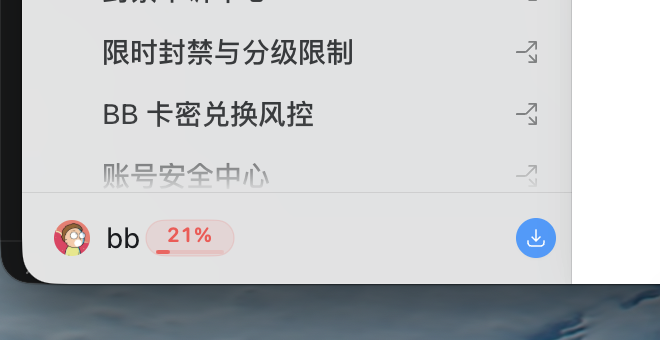
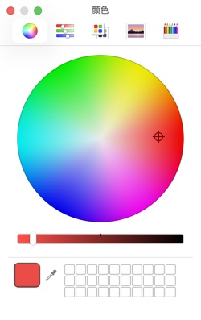

# Codex Quota for macOS & Windows

一个贴附在 Codex 客户端左下角账户名称旁的轻量额度徽标，显示套餐剩余额度百分比和进度条。

> 这是非官方社区项目，与 OpenAI 没有隶属或合作关系。Codex、ChatGPT 及 OpenAI 名称归其各自权利人所有。

## 快速下载

| 系统 | 下载 | 系统要求 |
| --- | --- | --- |
| macOS（Apple Silicon / Intel） | [下载最新版 `.zip`](https://github.com/qxlfd666-wq/codex-quota-macos/releases/latest/download/Codex-Quota-macOS.zip) | macOS 14 或更高版本 |
| Windows x64 | [下载最新版 `.exe`](https://github.com/qxlfd666-wq/codex-quota-macos/releases/latest/download/Codex-Quota-Windows-x64.exe) | Windows 10/11 x64 |
| Windows ARM64 | [下载最新版 `.exe`](https://github.com/qxlfd666-wq/codex-quota-macos/releases/latest/download/Codex-Quota-Windows-arm64.exe) | Windows 11 ARM64 |

也可以前往 [Releases 页面](https://github.com/qxlfd666-wq/codex-quota-macos/releases/latest) 下载压缩包和对应的 SHA-256 校验文件。

当前社区构建尚未使用 Apple Developer ID 或 Windows 商业代码签名证书，因此系统可能显示“未识别的开发者”或 Microsoft Defender SmartScreen 提示。请只从本仓库 Releases 下载并核对 SHA-256；正式签名需要项目维护者配置相应平台证书。

## 功能

- 百分比贴附在 Codex 原有的 `头像 + 用户名` 账户行旁边
- 红色细进度条直观显示剩余额度
- 点击徽标可自定义颜色，并自动记住选择
- Codex 位于前台时显示，切换应用或最小化后自动隐藏
- 跟随 Codex 窗口移动、缩放和切换显示器
- 每 60 秒自动刷新，也可从菜单栏或系统托盘手动刷新
- Windows 版可从托盘开启或关闭“开机自动启动”
- 使用本机 Codex app-server，不读取或保存登录令牌
- 不修改 ChatGPT/Codex 客户端，不注入代码，不影响官方自动更新

## 使用截图

### 用户名旁的剩余额度



### 点击徽标自定义颜色



## 使用方法

使用前请安装当前版本的 ChatGPT/Codex 客户端，并通过 ChatGPT 账户登录 Codex。API Key 按量计费模式不会返回套餐百分比。

### macOS

1. 下载并解压 `Codex-Quota-macOS.zip`。
2. 将 `Codex Quota.app` 拖入“应用程序”并打开。
3. 打开 Codex，额度徽标会出现在左下角账户名称旁。
4. 点击徽标可选择颜色；菜单栏的 `%` 图标可查看状态、刷新或退出。

### Windows

1. 下载 `Codex-Quota-Windows-x64.exe`，放到希望长期保存的位置。
2. 双击运行，然后打开 Codex。
3. 额度徽标会出现在左下角账户名称旁；点击徽标可选择颜色。
4. 右键系统托盘的 `%` 图标可以刷新、修改颜色、设置开机启动或退出。

如果托盘提示“未找到 Codex”，请先完整启动并登录官方客户端一次；仍无法识别时，可安装 Codex CLI，或通过 `CODEX_QUOTA_CODEX_PATH` 指定本机 `codex.exe` 的完整路径。

应用没有独立主窗口。只有徽标自身响应鼠标点击，不会拦截 Codex 的其余界面或键盘操作。Codex 左侧边栏需要保持展开；如果未来 Codex 调整账户栏布局，徽标偏移量可能需要同步更新。

## 从源码运行

### macOS

需要 Xcode 16 或更新版本：

```bash
swift run CodexQuota
```

构建 `.app` 和 `.zip`：

```bash
./scripts/build-app.sh
open "dist/Codex Quota.app"
```

### Windows

需要 Windows 和 .NET 8 SDK：

```powershell
dotnet run --project Windows/CodexQuota.Windows/CodexQuota.Windows.csproj
```

构建自包含单文件 `.exe`：

```powershell
dotnet publish Windows/CodexQuota.Windows/CodexQuota.Windows.csproj `
  --configuration Release `
  --runtime win-x64 `
  --self-contained true `
  -p:PublishSingleFile=true `
  -p:IncludeNativeLibrariesForSelfExtract=true
```

## 测试

```bash
swift test
dotnet test Windows/CodexQuota.Core.Tests/CodexQuota.Core.Tests.csproj
```

GitHub Actions 会在每次提交时验证 macOS 和 Windows 构建；推送 `v*` 标签后会自动创建 Release，并附带安装包和 SHA-256 校验文件。

## 数据来源与隐私

应用启动本机 `codex app-server`，完成 JSONL 初始化后调用：

```json
{ "method": "account/rateLimits/read", "id": 3 }
```

Codex 返回 `usedPercent` 后，应用将剩余额度计算为 `100 - usedPercent`。如果主要和次要窗口同时存在，徽标显示较低的剩余值，以提示当前最紧张的限制。

应用不会读取 `~/.codex/auth.json`、不会扫描会话历史、不会修改 Codex 客户端，也不会自行访问私有额度 HTTP 接口。登录与令牌刷新完全交给本机 Codex 处理。

## 许可证

本项目使用 [MIT License](LICENSE)。
